# Mario & Luigi — port a JavaScript

[](https://github.com/gabom88/mario-luigi-js/actions/workflows/pages.yml)

### ▶ **[Jugar ahora: gabom88.github.io/mario-luigi-js](https://gabom88.github.io/mario-luigi-js/)**

Port al navegador de **Mario & Luigi**, el juego de plataformas que
**Mike Wiering** programó en 1994 en Turbo Pascal para PC con VGA.
Funciona en el ordenador y en el móvil (vertical u horizontal), con teclado,
mando o controles táctiles, se puede **instalar como app** y se juega **sin
conexión**.

Web oficial del juego original: **<https://wieringsoftware.nl/mario/index.html>**

| | |
|---|---|
| 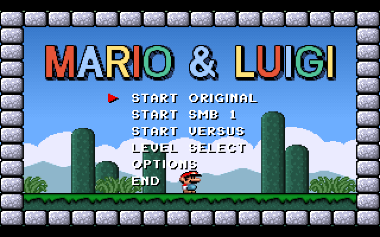 | 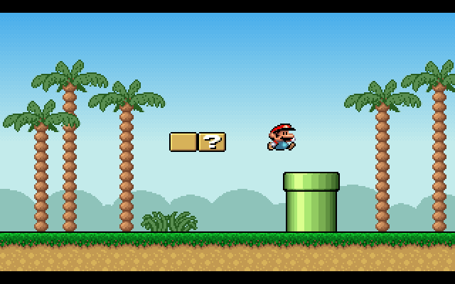 |
| 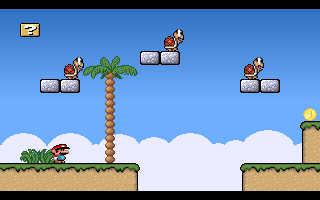 | 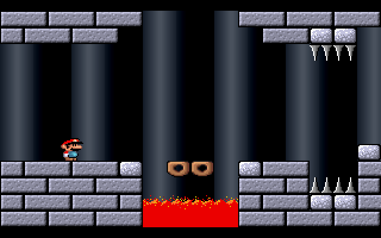 |
| 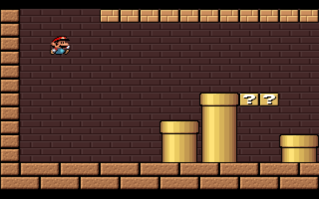 | 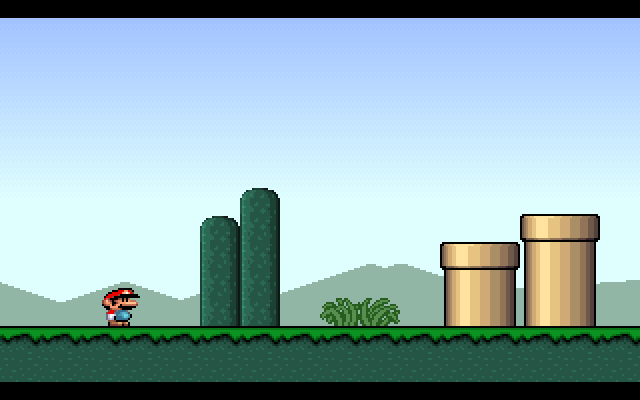 |
| 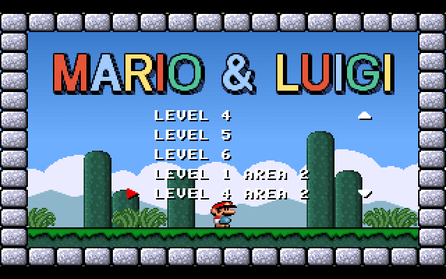 | 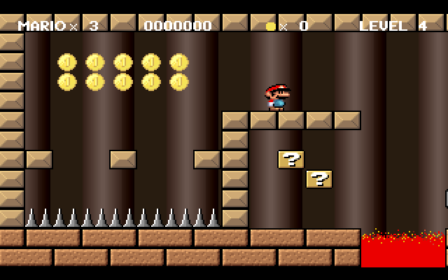 |
| 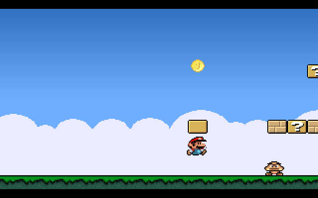 | 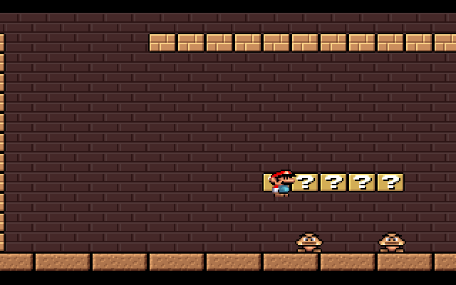 |

---

## Índice

1. [El juego original](#el-juego-original)
2. [Qué ofrece este port](#qué-ofrece-este-port)
3. [Cómo jugar](#cómo-jugar)
4. [Controles](#controles)
5. [Panel de ajustes](#panel-de-ajustes)
6. [Menú del juego y LEVEL SELECT](#menú-del-juego-y-level-select)
   - [Modo START VERSUS](#modo-start-versus)
   - [Modo START SMB 1](#modo-start-smb-1)
7. [Editor de niveles](#editor-de-niveles)
8. [Trucos del original](#trucos-del-original)
9. [Partidas guardadas y datos locales](#partidas-guardadas-y-datos-locales)
10. [Cómo está hecho](#cómo-está-hecho)
11. [Fidelidad y diferencias con el original](#fidelidad-y-diferencias-con-el-original)
12. [Desarrollo](#desarrollo)
13. [Estructura del repositorio](#estructura-del-repositorio)
14. [Créditos y licencia](#créditos-y-licencia)

---

## El juego original

*Mario & Luigi* es un clon de *Super Mario Bros.* con **seis niveles** que
Mike Wiering escribió en 1994 para practicar la programación de la VGA. Su
objetivo era un juego de PC con **scroll parallax en varias capas** que se
moviera con suavidad en su 486 a 25 MHz. El ejecutable ocupaba **menos de
64 KB**.

Algunos detalles técnicos del original, todos reproducidos en este port:

- Modo VGA 320×200 a 256 colores en **modo planar** ("modo X"), con
  **doble página** y una pantalla virtual 40 píxeles más ancha que la
  visible, de modo que al avanzar un píxel se dibuja un bloque entero nuevo.
- La memoria de vídeo sobrante se usa como **pila para guardar el fondo**
  detrás de cada sprite, copiando con los *latches* de la VGA.
- **Parallax** de dos formas: las colinas se mueven redibujando solo los
  píxeles que cambian, y los ladrillos y columnas del fondo se animan
  **rotando la paleta**.
- Los niveles están escritos a mano en el código (`WORLDS.PAS`): cada
  carácter es un bloque.
- Los sprites se hicieron con el editor **GRED** del propio autor.
- La música y los efectos suenan por el **altavoz del PC**.

El autor publicó después el **código fuente completo** (para Turbo Pascal
6/7, y una versión para TP 5.5) en la web oficial:

- Presentación: <https://wieringsoftware.nl/mario/index.html>
- Código fuente: <https://wieringsoftware.nl/mario/source.html>
- Otros juegos del autor: <https://wieringsoftware.nl/mario/games.html>

Este repositorio incluye ese código fuente original (ver
[Estructura del repositorio](#estructura-del-repositorio)).

---

## Qué ofrece este port

- **Tres modos de juego**: *START ORIGINAL* (el juego de 1994),
  *START SMB 1*, con 15 niveles de *Super Mario Bros.* (NES) adaptados al
  motor original, y *START VERSUS*, con Mario y Luigi jugando a la vez en
  la misma pantalla.
- **El juego completo**: menú, los 6 niveles con sus áreas secundarias,
  la segunda vuelta "turbo", 1 o 2 jugadores, partidas guardadas y la demo
  automática de la pantalla de título.
- **Fiel al original**: la VGA se emula a nivel de memoria y el código
  Pascal se tradujo casi línea a línea. La demo grabada en 1994 se
  reproduce exactamente igual, frame a frame.
- **Controles remapeables** (dos teclas por acción), **mando** y
  **controles táctiles** ajustables en posición, tamaño y opacidad.
- **Mario o Luigi** a elegir para cada jugador.
- **LEVEL SELECT** con todos los niveles, incluidos los que el juego no deja
  elegir.
- **Editor de niveles** con todos los bloques del motor: edita los niveles
  originales, los de SMB o crea los tuyos, pruébalos al instante y juégalos
  desde el menú.
- **Extras opcionales**: filtro CRT, sonido mejorado y vibración en móviles.
- **App instalable (PWA)** con iconos hechos con los sprites del juego;
  funciona sin conexión.
- **Scroll suave** sincronizado con el monitor y escalado sin parpadeo.

---

## Cómo jugar

### En el navegador

Abre **<https://gabom88.github.io/mario-luigi-js/>**, revisa los ajustes si
quieres y pulsa **Jugar** (o Enter).

### Instalarlo como app

| Dispositivo | Cómo |
|---|---|
| Android (Chrome) | Menú ⋮ → **Instalar aplicación** / *Añadir a pantalla de inicio* |
| iPhone / iPad (Safari) | Compartir → **Añadir a pantalla de inicio** |
| Ordenador (Chrome, Edge) | Icono de instalar en la barra de direcciones |

Instalado se abre a pantalla completa, sin barras del navegador, y funciona
sin internet. En iPhone, Safari no permite pantalla completa en una página
normal: la forma de tenerla es instalar la app.

### En local

Hace falta [Node.js](https://nodejs.org/) (cualquier versión reciente) y no
hay dependencias que instalar:

```
cd web
npm start
```

y abre <http://localhost:8080/>. El juego usa módulos de JavaScript, así que
debe servirse por http; abrir `index.html` con doble clic no funciona.

---

## Controles

### Teclado (por defecto)

| Acción | Tecla |
|---|---|
| Moverse | **W A S D** |
| Saltar | **M** |
| Correr **y** disparar | **N** (estilo NES: un mismo botón) |
| Apuntar el disparo | W / S mientras disparas |
| Entrar en una tubería | **S** sobre ella, o **W** saltando hacia una de arriba |

| Sistema | Tecla |
|---|---|
| Aceptar en los menús | **Enter** |
| Pausa | **P** |
| Mostrar u ocultar el marcador | **I** |
| Sonido sí/no | **Q** |
| Salir del nivel / atrás en menús | **Esc** |
| Pantalla completa | **F** |

**Player 2 (modo START VERSUS)**: flechas para moverse, **.** (punto) o **0** del
teclado numérico para saltar y **,** (coma) o **.** del teclado numérico para
correr y disparar.

En los menús también funcionan las flechas. Todas las teclas se pueden
cambiar en el [panel de ajustes](#panel-de-ajustes). El original usaba
flechas, **Alt** (saltar), **Ctrl** (correr) y **Espacio** (disparar);
puedes volver a asignarlas si lo prefieres.

### Mando

Cruceta o stick para moverse, **A / Y** para saltar y **B / X** para correr
y disparar (Gamepad API, sin configuración). En START VERSUS el primer mando
conectado es Player 1 y el segundo, Player 2.

### Controles táctiles

Se activan en el panel (vienen activados en dispositivos táctiles):

- **← →**: flechas grandes para caminar; puedes deslizar el dedo entre ellas.
- **A**: saltar. **B**: correr y disparar. Deslizando el pulgar entre A y B
  se pulsan los dos.
- **⇅**: entrar en tuberías, hacia abajo o saltando hacia una de arriba.
- **START**, **PAUSA**, **ESC** y **⛶** (pantalla completa), abajo en el centro.
- En los menús, ← → mueven la selección y **B** o **START** eligen.
- **Controles de Player 2**: un segundo juego de botones, en verde, para el
  modo START VERSUS en el mismo dispositivo. Se activa y desactiva en el panel.

Para colocar los controles **arrástralos**: pulsa **Mover controles** en el
panel (se oculta el panel y aparecen todos los botones) y termina con
**Listo**. El tamaño de cada control (flechas, A, B y Acción) se cambia con
su deslizador, y otro deslizador cambia la opacidad de todo el juego de
controles. Player 2 tiene los mismos ajustes, independientes.

En vertical la pantalla del juego queda arriba y los controles debajo; en
horizontal los controles quedan a los lados.

---

## Panel de ajustes

Es la pantalla inicial. Durante la partida se vuelve a abrir con el botón
**⚙** de la esquina superior derecha. Todo se guarda automáticamente.

Los ajustes están en dos pestañas: **Juego** (personajes, pantalla, extras y
controles de teclado) y **Táctil** (controles táctiles). La vista previa de
los botones táctiles solo aparece en la pestaña Táctil.

| Sección | Opciones |
|---|---|
| **Personajes** | Mario o Luigi para Player 1 y Player 2 (por defecto Mario y Luigi). Cambia los sprites, el nombre en el marcador y los carteles. Pueden ser el mismo. |
| **Controles de teclado** | Dos teclas por acción. Clic en una casilla y pulsa la tecla nueva; **Supr** la borra y **Esc** cancela. Una tecla con varias acciones se muestra en **amarillo**. Las acciones de juego pueden compartir tecla (como N para correr y disparar), pero las de **Sistema** no. Esc y Tab no se pueden asignar. |
| **Pantalla** | *Sincronización*: **Suave** (un frame del juego por refresco del monitor; scroll sin tirones, pero a 60 Hz el juego va un 14% más lento que el original; en pantallas de 90/120/144 Hz, o que cambian de frecuencia como muchos Android, la velocidad se limita con el reloj real a 55–72 frames por segundo) u **Original** (70 fps exactos, como un monitor VGA). *Escalado*: **Nítido sin parpadeo** (ampliación entera más un filtrado final, todos los píxeles del mismo tamaño) o **Píxel exacto**. |
| **Extras** | **Filtro CRT** (líneas de barrido alineadas con las 200 líneas de la VGA, máscara de fósforo, viñeta). **Sonido mejorado** (notas con envolvente, filtro y eco en lugar del pitido del altavoz). **Vibración** en móviles al recibir daño, pisar enemigos y romper bloques. |
| **Controles táctiles** | Activar/desactivar, y activar/desactivar los **controles de Player 2**. La posición se ajusta **arrastrando** cada control (botón *Mover controles*); el tamaño de las flechas y de los botones A, B y ⇅ con un deslizador para cada uno, y la opacidad con un deslizador por jugador, con vista previa en vivo. **Cada orientación (vertical y horizontal) guarda su propia distribución** y se cambia sola al girar el móvil. **Plantillas**: guarda la distribución actual con un nombre y aplícala después a cualquier orientación (o bórrala). |

---

## Menú del juego y LEVEL SELECT

El menú es el del original, con varias opciones añadidas:

- **START ORIGINAL**: el juego de 1994. *No save* (partida sin guardar,
  1 o 2 jugadores), *Game select* (3 ranuras de partida guardada) y *Erase*.
- **START SMB 1**: los niveles de *Super Mario Bros.*, para 1 o 2 jugadores
  (ver [abajo](#modo-start-smb-1)).
- **START VERSUS**: Player 1 y Player 2 juegan a la vez el mismo nivel, con
  los niveles originales o los de SMB 1 (ver [abajo](#modo-start-versus)).
- **LEVEL SELECT**: empezar en cualquier nivel de los dos modos (nuevo en
  este port).
- **OPTIONS**: sonido y marcador.
- **END**: vuelve al título (en el navegador no hay DOS al que salir).

Si no tocas nada durante unos segundos empieza la **demo**: la partida que
grabó el autor en 1994.

### LEVEL SELECT

Incluye todo lo que hay en `WORLDS.PAS`, también lo que el juego normal no
deja elegir:

| Entrada | Qué es |
|---|---|
| **LEVEL 1 … LEVEL 6** | Los seis niveles; al superar uno se sigue con el siguiente. |
| **LEVEL 1/4/5/6 AREA 2** | Las zonas secundarias, a las que normalmente solo se llega por una tubería; su tubería de salida lleva al área principal. |
| **LEVEL 1 … 6 TURBO** | La segunda vuelta que el juego desbloquea al terminarlo: enemigos y jugador más rápidos y variantes propias de los niveles. |
| **TITLE MAP** | El pequeño escenario de la pantalla de título, jugable (Esc para salir). |
| **SMB 1-1 … SMB 8-1** | Los niveles de *Super Mario Bros.*; al superar uno se sigue con el siguiente. |
| **+ NOMBRE** | Tus niveles guardados con el [editor](#editor-de-niveles). |

Las áreas secundarias de los niveles 2 y 3 existen en el código fuente pero
están vacías (no tienen datos), por eso no aparecen. Desde LEVEL SELECT la
partida es de un jugador y no se guarda.

### Modo START VERSUS

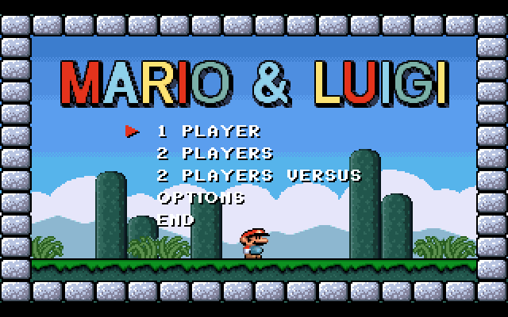

*START VERSUS* es un modo para dos jugadores en el mismo dispositivo que no
existía en el original. En el menú elige **START VERSUS** y luego
**ORIGINAL LEVELS** (los 6 niveles de 1994) o **SMB 1 LEVELS** (los de
*Super Mario Bros.*). Player 1 y Player 2 aparecen a la vez en el nivel y lo
juegan juntos, cada uno con sus controles (teclado, mando o su propio juego
de botones táctiles) y con el personaje elegido en el panel. En la animación,
Mario pisa un Goomba, muere con el siguiente, Luigi sigue jugando y Mario
reaparece a su lado.

- **Vidas, monedas y puntos son comunes.** El tamaño (pequeño, grande, fuego)
  es de cada jugador.
- Si un jugador muere, **reaparece a los pocos segundos** junto al otro,
  parpadeando, y se gasta una vida.
- Si los dos están muertos a la vez, el nivel se reinicia como en el juego
  normal. Con la última vida, morir termina la partida.
- La **cámara** se centra entre los dos y no deja que ninguno salga de la
  pantalla: si se separan demasiado, el borde frena al que va delante.
- Si cualquiera de los dos entra en una **tubería**, un **warp** o la
  **salida**, los dos pasan juntos sin esperar al otro.

### Modo START SMB 1

Quince niveles de *Super Mario Bros.* (NES) jugados con el motor, la física
y los gráficos de *Mario & Luigi*: **1-1, 1-2, 1-3, 2-1, 3-1, 3-3, 4-1, 4-2,
5-1, 5-3, 6-1, 6-2, 6-3, 7-1 y 8-1**. Son los que incluye el corpus del que
salen; no hay castillos (x-4) ni niveles acuáticos. Al terminar el 8-1 la
partida vuelve a empezar en modo turbo, como la segunda vuelta del original.

Cómo se adaptaron:

- **Origen**: los niveles en texto del
  [Video Game Level Corpus (VGLC)](https://github.com/TheVGLC/TheVGLC/tree/master/Super%20Mario%20Bros),
  carpeta `Processed` (licencia MIT). Se usa `Processed` y no `Paths`,
  porque en `Paths` está dibujado encima el recorrido de un jugador y los
  bloques ya golpeados.
- **Tamaño**: los niveles de SMB miden 14 filas y la fila superior siempre
  está vacía; sin ella encajan exactos en las 13 filas del motor. El motor
  se amplió de 236 a 600 columnas para que quepa el 8-1 (373). Los niveles
  originales no cambian.
- **Bloques**: el suelo y los bloques duros son terreno del motor (con
  bordes de hierba); las plataformas de una sola fila, tablones de madera;
  los ladrillos se rompen; los `?` dan champiñón o flor y los `Q`,
  monedas; los cañones son bloques de piedra.
- **Enemigos**: Goombas, y Koopas verdes a partir del mundo 2 (rojos, que
  se dan la vuelta en los bordes, en las copas de los árboles). Desde el
  1-2 hay plantas piraña en las tuberías.
- **Final**: el motor no tiene bandera. Se quita la base del mástil y en su
  lugar hay una **tubería de salida**: súbete y pulsa **abajo** (o ⇅ en
  táctil) para pasar al siguiente nivel.
- **Aspecto**: cada nivel usa el cielo, el suelo y el fondo de uno de los
  niveles originales: día con colinas, noche (3-1 y 6-1), subterráneo de
  ladrillo (1-2 y 4-2), copas de árboles (x-3) y atardecer (7-1 y 8-1).
- El marcador muestra **WORLD 1-1**, etc. (como una línea que el autor dejó
  comentada en `STATUS.PAS`).

La conversión está en [`web/src/smb.js`](web/src/smb.js); los textos
originales, en [`web/levels/smb/`](web/levels/smb/).

> Curiosidad: el orden de juego no coincide con los nombres del código. Los
> niveles 4, 5 y 6 del juego son `Level_5`, `Level_6` y `Level_4` de
> `WORLDS.PAS`.

---

## Editor de niveles

**▶ [gabom88.github.io/mario-luigi-js/editor.html](https://gabom88.github.io/mario-luigi-js/editor.html)**
(también desde el enlace «✏️ Editor de niveles» del panel de ajustes)

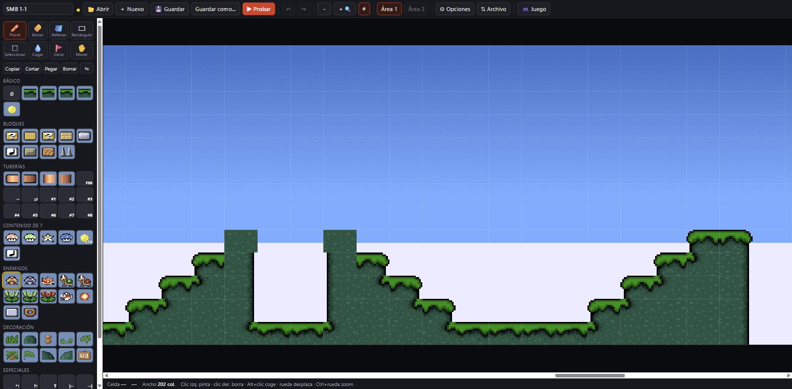

El nivel se dibuja con **el propio motor del juego**, así que se ve
exactamente como al jugarlo, incluidos los bordes automáticos del terreno.
Lo que el motor no dibuja (enemigos, contenido de los bloques `?`, enlaces
de tuberías, inicio del jugador) aparece como icono encima.

**Abrir**: cualquier nivel original (con su área 2), el mapa del título,
los 15 de *Super Mario Bros.* o tus niveles. Los del juego se editan como
copia: al guardar se crean en *Mis niveles*.

**Herramientas**

| Herramienta | Tecla | Uso |
|---|---|---|
| ✏️ Pincel | B | Pinta el bloque elegido (arrastrando dibuja líneas) |
| 🧽 Borrar | E | Vacía celdas (también con el botón derecho del ratón) |
| 🪣 Rellenar | F | Rellena la zona contigua del mismo bloque |
| ▭ Rectángulo | R | Rellena un rectángulo |
| ⬚ Seleccionar | M | Selección para **copiar, cortar, pegar, borrar y voltear** (Ctrl+C / X / V, Supr) |
| 💧 Coger | I | Toma el bloque de una celda (también Alt+clic) |
| 🚩 Inicio | J | Dónde empieza Mario (clic donde van sus pies) |
| 🔗 Enlace | L | Conecta una tubería: elige a dónde lleva y, si es otra zona, haz clic en la tubería de llegada |
| ✋ Mover | H | Desplaza la vista (también con la rueda, el botón central o Espacio+arrastrar) |

Más: **deshacer y rehacer** (Ctrl+Z / Ctrl+Y), zoom (+/−, Ctrl+rueda),
cuadrícula (G) con una línea cada 16 columnas (una pantalla), probar (P),
guardar (Ctrl+S). En el móvil, dos dedos desplazan y hacen zoom, y la paleta
es un panel desplegable.

**Paleta**: todos los bloques del motor, agrupados.

- **Básico**: terreno A–D, **terrenos 2 y 3** (para mezclar tipos de suelo)
  y moneda.
- **Bloques**: `?`, usado, invisible, ladrillo, piedra, nota, X, madera y
  pinchos.
- **Tuberías**: las cuatro piezas y la salida del nivel.
- **Enlaces de tubería (avanzado)**: los códigos que escribe la herramienta
  🔗, por si quieres ponerlos a mano.
- **Contenido de ?**: champiñón o flor, vida, estrella, veneno, 10 monedas y
  convertir en nota.
- **Enemigos**: Goomba, erizo, Koopas, tres pirañas, pez, bola de lava y
  dos plataformas.
- **Decoración**: hierba, vallas, palmeras, cascadas, árboles, lava y la
  puerta EXIT.
- **Especiales**: moneda alta, `?` con vida alta, topes de scroll y modo
  turbo.

Cada bloque muestra una ayuda al elegirlo.

**Zonas y warps**: un nivel puede tener hasta **8 zonas** (pestañas
1, 2, … y «+» en la barra). Con la herramienta **🔗 Enlace** haces clic en
la boca de una tubería y eliges a dónde lleva:

- **otra tubería de la misma zona** o **de otra zona** (con *ida y vuelta*
  opcional): después haces clic en la tubería de llegada y el editor
  escribe los códigos de los dos extremos;
- **salida del nivel**;
- **warp**: termina el nivel y, en el modo de juego, **avanza varios
  niveles**, como las *warp zones* de Super Mario Bros.

El juego recuerda el estado de cada zona (monedas, bloques rotos) al ir y
volver, como hacía el original con sus dos áreas.

**Mezclar terrenos**: además del terreno A–D, los **terrenos 2 y 3** usan el
«Suelo 2» y «Suelo 3» de las opciones (verde, arena, marrón, hierba,
desierto o verde recoloreado). Cada uno tiene sus propios bordes, así que
en un mismo nivel puede haber, por ejemplo, praderas, arena y roca.

**Temas** (🎨 en la barra): aplica el cielo, el fondo, el suelo y los
colores de cualquier escenario del juego (los 6 niveles, sus áreas y la
segunda vuelta). Los terrenos 2 y 3 que hayas elegido se mantienen.

Cómo funcionan algunos códigos del motor:

- **Bloque `?`**: da lo que haya en la celda **de encima** (champiñón, vida,
  estrella…); si está vacía, una moneda.
- **Tuberías**: en las dos celdas sobre la boca, la izquierda indica el
  destino (**FIN** = salida del nivel, **→** = otra tubería de la misma
  área, **⇄** = la otra área) y la derecha el **número de pareja**. Dos
  tuberías con el mismo número están conectadas.
- **Pirañas, peces y bolas de lava** se colocan 2 filas por encima de donde
  aparecen.

**Opciones de la zona** (⚙): cielo, fondo, tipo de suelo (y suelos 2 y 3), decoración,
horizonte, colores (tuberías, suelo, ladrillos, madera, bloque X, fondo,
hierba), ancho de la zona (17 a 600 columnas), insertar o borrar columnas y
eliminar la zona. «Copiar aspecto de» toma todo el estilo de un
nivel existente. Las colinas del fondo (parallax) solo se ven al probar.

**Probar** (▶): abre el juego con el nivel; al superarlo o salir con Esc
vuelves al editor tal como lo dejaste.

**Guardar y compartir**

- **Guardar** lo añade a *Mis niveles* (en este navegador), que aparecen en
  LEVEL SELECT.
- **Archivo → Descargar .json / Copiar JSON / Importar**: para pasar niveles
  entre dispositivos o compartirlos. El formato es legible: 13 filas de
  texto con un carácter por bloque, como en `WORLDS.PAS`.
- **Descargar para WORLDS.PAS**: el nivel y sus opciones como procedimientos
  `db` de Turbo Pascal, listos para el código original.

El trabajo en curso se guarda solo; al volver al editor está como lo
dejaste.

## Trucos del original

El código fuente original tiene trucos ocultos y funcionan igual en este
port. Para usarlos:

1. Pulsa **P** para pausar y suelta la tecla.
2. Pulsa **Tab**.
3. Escribe el código. Termina al completarse uno válido o al pulsar una
   tecla que no sea letra ni número.

| Código | Efecto |
|---|---|
| `03E8` | Una vida extra |
| `B172` | 10000 vidas |
| `F1F2` | Champiñón (crecer) |
| `FFB5` | Flor de fuego |
| `9C32` | Estrella (invencible) |
| `1UP` | Hace caer un champiñón de vida… y la siguiente vez, uno venenoso |
| `D235` | Activa/desactiva el modo turbo |
| `2305` | Pasar al siguiente nivel |
| `MONO` | Colores en blanco y negro |
| `EGAMODE` | Colores reducidos, estilo EGA |
| `VGAMODE` o `COLOR` | Colores normales |
| `CREDITS` | Muestra el crédito del autor |
| `TEST` o `0044` | Herramienta de depuración: marca el tiempo de retrazado |
| `76DD` | Grabar una demo |
| `C7B4` | Reproducir la demo grabada |
| `208D` | Guardar la demo grabada (en el navegador se descarga un archivo) |

---

## Partidas guardadas y datos locales

Todo se guarda en el `localStorage` del navegador, en tu dispositivo
(también *Mis niveles* y el trabajo en curso del editor):

- Ajustes del panel: teclas, personajes, pantalla, extras y controles táctiles.
- Sonido y marcador (también si los cambias jugando con Q o I).
- Las 3 ranuras de partida (*Game select*), que se actualizan después de
  cada nivel superado.

Borrar los datos del sitio en el navegador reinicia todo.

---

## Cómo está hecho

El port no reimplementa el juego desde cero: **emula el hardware que usaba**
y traduce el código Pascal casi línea a línea. Así se conservan la física,
las colisiones y hasta los pequeños fallos del original.

### 1. Extracción de datos

[`web/tools/convert.mjs`](web/tools/convert.mjs) lee los archivos originales
(`.PAS`, `.$00`…, `.BK`, `MPAL256`, `DEMOKEYS.OBJ`) y genera
`web/src/data.js` con:

- **204 bloques de datos**: sprites (en el formato planar original de la
  VGA), niveles y sus opciones, mapas de las colinas y la paleta.
- Las **dos fuentes** de texto de `TXT.PAS`.
- La **demo grabada**, extraída del archivo objeto OMF `DEMOKEYS.OBJ`.

### 2. Emulación de la VGA

[`web/src/vga256.js`](web/src/vga256.js) reproduce el modo X que usaba el
juego: 4 planos de 64 KB, pantalla virtual de 360 píxeles, dos páginas,
registro de inicio de pantalla, desplazamiento fino horizontal, paleta DAC
de 6 bits y copias con *latches*. Las rutinas en ensamblador
(`PutImage`, `DrawImage`, `PushBackGr`…) se tradujeron respetando su
aritmética de direcciones de 16 bits, incluido el desbordamiento. Cada
frame se convierte a RGBA y se dibuja en un `<canvas>`.

### 3. Traducción de las unidades Pascal

Cada unidad tiene su módulo JavaScript:

| Pascal | JavaScript | Contenido |
|---|---|---|
| `MARIO.PAS` | `mario.js` | Programa principal, menú, demo, secuencia de niveles |
| `PLAY.PAS` | `play.js` | Bucle de un nivel, scroll, pausa y trucos |
| `PLAYERS.PAS` | `players.js` | Movimiento, física y colisiones del jugador |
| `ENEMIES.PAS` | `enemies.js` | Enemigos, power-ups, bolas de fuego, plataformas |
| `FIGURES.PAS` | `figures.js` | Bloques del nivel, cielo, construcción del mundo |
| `BACKGR.PAS` | `backgr.js` | Fondos parallax y animación por paleta |
| `PALETTES.PAS` | `palettes.js` | Paleta, fundidos, animaciones de color |
| `BLOCKS.PAS`, `TMPOBJ.PAS`, `GLITTER.PAS` | `blocks.js`, `tmpobj.js`, `glitter.js` | Bloques golpeados, monedas y fragmentos, destellos |
| `TXT.PAS`, `STATUS.PAS` | `txt.js`, `status.js` | Texto y marcador |
| `MUSIC.PAS` | `music.js` + `sound.js` | Melodías y altavoz del PC (Web Audio) |
| — | `smb.js`, `smbdata.js` | Niveles de *Super Mario Bros.* (VGLC) convertidos al formato del motor |
| — | `levels.js` | Modelo de nivel común al juego y al editor: áreas, JSON, exportación Pascal, *Mis niveles* |
| — | `editor/editor.js`, `editor/render.js`, `editor/catalog.js` | Editor de niveles: interfaz, dibujo con el motor y catálogo de bloques |
| `KEYBOARD.PAS`, `JOYSTICK.PAS` | `keyboard.js`, `joystick.js` | Teclado remapeable y demo; mando (Gamepad API) |
| `BUFFERS.PAS`, `VGA256.PAS` | `buffers.js`, `vga256.js` | Estado compartido, mapa del mundo; VGA |
| — | `pascal.js` | `Random` de Turbo Pascal 7, `Round`, `div`… |
| — | `ui.js`, `extras.js`, `main.js` | Panel de ajustes, controles táctiles, CRT, PWA |
| — | `versus.js` | Modo START VERSUS: dos jugadores, reaparición y cámara compartida |

### 4. Bucles bloqueantes con `async/await`

El original espera al retrazado vertical dentro de sus bucles (`ShowPage`,
fundidos, menús). En el navegador esas esperas son `await` sobre un reloj de
retrazado emulado, así que el flujo de control de cada procedimiento queda
como en el original.

---

## Fidelidad y diferencias con el original

**Prueba de fidelidad.** La demo de la pantalla de título reproduce las
teclas que grabó el autor; cualquier diferencia en la física o en los
enemigos haría que Mario muriera o se desviara. En este port la demo
recorre sus ~1500 frames y termina entrando exactamente en la tubería
prevista.

Diferencias conocidas:

- **Demo**: se grabó con una versión anterior del juego que leía ← y → dos
  veces por frame (todos sus contadores son pares). Al reproducirla se leen
  dos veces; con el código publicado tal cual, Mario moría a los pocos
  segundos.
- **Nubes, estrellas y los fondos de tipo 5 y 7** estaban escritos para el
  modo VGA lineal y ningún nivel los usa: se dejaron como funciones vacías.
- **END** vuelve al título.
- **Velocidad**: con la sincronización *Suave* en monitores de 60 Hz el
  juego va al 86% de la velocidad original; la opción *Original* da los
  70 fps exactos.
- **Partidas y ajustes** se guardan en `localStorage` en lugar del archivo
  `MARIO.CFG`.
- **Límites ampliados** para los niveles del editor: el original admitía 25
  enemigos a la vez (ahora 150), 20 objetos temporales (60) y 75 destellos
  (200). Además, el fondo que se guarda detrás de cada sprite ocupaba la
  memoria de vídeo sobrante (~11 KB por página): con unos 20 Koopas en
  pantalla se desbordaba y corrompía la imagen. Ahora se guarda en memoria
  normal, sin límite y con el mismo resultado visual.
- **Códigos nuevos** (que ningún nivel original usa): terrenos 2 y 3
  (`$B2`–`$B5`), tuberías a zonas (`$C0`–`$C7`), warps (`$D1`–`$D7`) y
  tubería solo de llegada (`$EE`).
- **Añadido**: remapeo de teclas, controles táctiles, mando, elección de
  personaje, LEVEL SELECT, extras y PWA.

---

## Desarrollo

Todo está en `web/` y no tiene dependencias externas.

| Comando (desde `web/`) | Qué hace |
|---|---|
| `npm start` | Servidor local en <http://localhost:8080/> (`serve.mjs`) |
| `npm run convert` | Regenera `src/data.js` a partir de los archivos originales |
| `node tools/smb-import.mjs` | Regenera `src/smbdata.js` a partir de `levels/smb/*.txt` |
| `SMB=1-1 node tools/snap.mjs smb <carpeta>` | Prueba un nivel de SMB sin navegador (`EXIT=1` empieza sobre la tubería de salida) |
| `node tools/icons.mjs` | Regenera los iconos de la app a partir de los sprites |
| `node tools/snap.mjs level1 <carpeta>` | Ejecuta el juego sin navegador y guarda capturas PNG (`LEVEL=0..5` elige nivel, `LUIGI=1` usa a Luigi) |
| `node tools/snap.mjs intro\|levelselect\|demo <carpeta>` | Recorre el menú, el LEVEL SELECT o la demo y guarda capturas |

**Publicación.** Cada `push` a `main` publica `web/` en GitHub Pages
mediante [`.github/workflows/pages.yml`](.github/workflows/pages.yml).

**Caché sin conexión.** `web/sw.js` guarda en caché los archivos de la
lista `FILES`. Si añades archivos, inclúyelos ahí y sube la versión de
`CACHE` (por ejemplo `mario-luigi-v2`).

**Archivos originales.** `.gitattributes` los marca como binarios para que
git no altere sus finales de línea ni su contenido.

---

## Estructura del repositorio

```
├── web/                     El port a JavaScript (lo que se publica)
│   ├── index.html           Página, panel de ajustes y estilos
│   ├── editor.html          Editor de niveles
│   ├── manifest.webmanifest Manifiesto de la app (PWA)
│   ├── sw.js                Service worker (juego sin conexión)
│   ├── serve.mjs            Servidor local
│   ├── icons/               Iconos generados con los sprites
│   ├── levels/smb/          Niveles de Super Mario Bros. del VGLC (MIT)
│   ├── src/                 Código del juego (ver "Cómo está hecho")
│   └── tools/               Conversor de datos, iconos y arnés de pruebas
├── docs/screenshots/        Capturas para este README
├── *.PAS                    Código fuente original en Turbo Pascal
├── *.$00, *.$01 …           Sprites originales como código incluible (planar)
├── *.000, *.001 …           Sprites originales en el formato de GRED
├── *.BK, BOGEN7, BOGEN26    Perfiles de las colinas del fondo
├── MPAL256, DEFAULT.PAL     Paleta de colores
├── DEMOKEYS.OBJ             Demo grabada (archivo objeto)
├── README.TXT               README original del código fuente
├── MARIO.TXT                Instrucciones originales del juego
└── GRED.TXT                 Manual del editor de sprites GRED
```

No se incluyen `MARIOSRC.ZIP` ni los ejecutables de DOS (`GRED.EXE`,
`BIN2PAS.EXE`); se pueden descargar de la
[web oficial](https://wieringsoftware.nl/mario/source.html).

---

## Créditos y licencia

- **Juego original, gráficos y código fuente**: © 1994-2001
  **Mike Wiering** — <https://wieringsoftware.nl/mario/index.html>.
  Su [`README.TXT`](README.TXT) permite estudiar el código, reutilizar
  fragmentos dándole crédito y **portar el juego a otra plataforma o
  lenguaje** (pidiendo que se le avise). No permite distribuirlo como obra
  propia.
- **Port a JavaScript**: Gabo
  ([@gabom88](https://github.com/gabom88)), desarrollado con Claude
  (Anthropic).
- **Niveles de *Super Mario Bros.* en texto**: *The Video Game Level
  Corpus* (VGLC) de Adam Summerville, Santiago Ontañón y Sam Snodgrass,
  licencia MIT ([`web/levels/smb/LICENSE-VGLC.md`](web/levels/smb/LICENSE-VGLC.md)).
  El diseño original de esos niveles es de Nintendo.
- *Mario* y *Luigi* son marcas registradas de **Nintendo**. Este es un
  proyecto de aficionado, sin ánimo de lucro y sin relación con Nintendo.

Otros juegos de Mike Wiering hechos con el mismo motor o en la misma época:
[Charlie the Duck](http://www.wieringsoftware.nl/charlie/),
[Charlie II](http://www.wieringsoftware.nl/ch2/),
[Super Angelo](http://www.wieringsoftware.nl/angelo/),
[Sint Nicolaas](http://www.wieringsoftware.nl/sint/) y
[Super Worms](http://www.wieringsoftware.nl/sw/).
